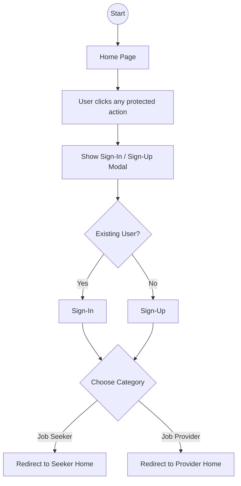
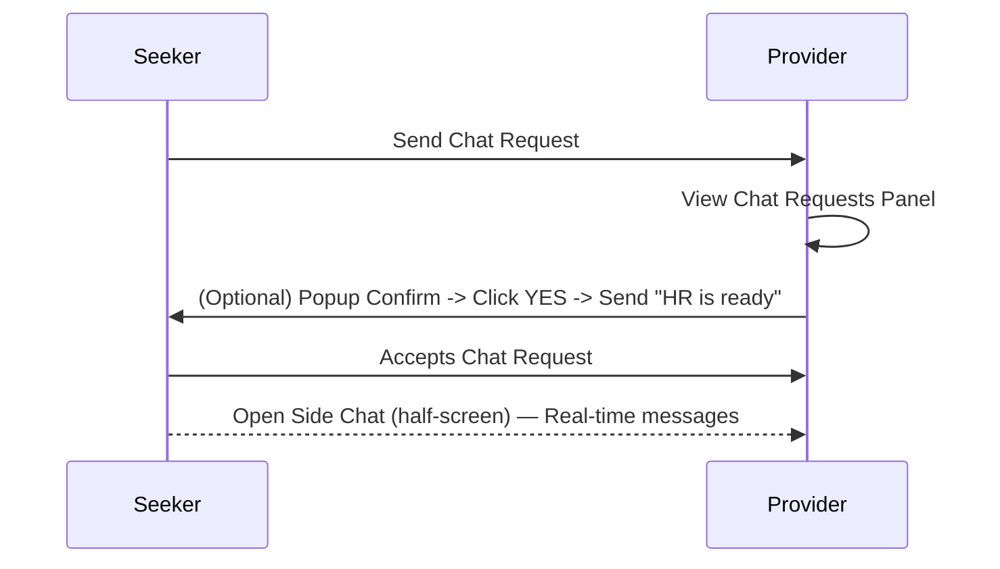
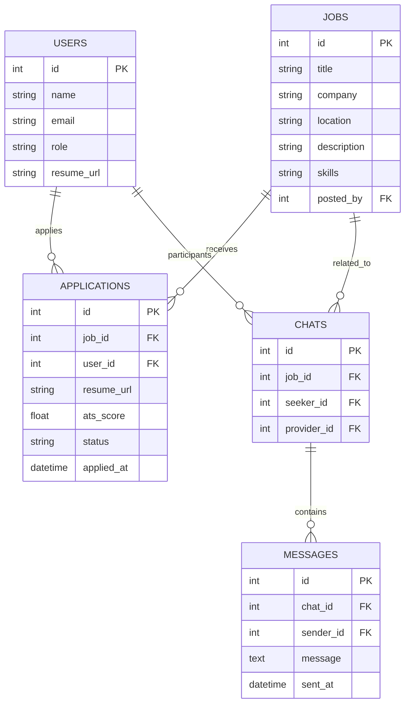

# NiyuktiPath — Flowcharts & Diagrams

This document contains **visual diagrams** (Mermaid syntax) for your NiyuktiPath platform, including:

* Full system flowchart
* Separate flowcharts for Login, Job Seeker, and Job Provider
* Chat request flow
* System architecture (component-level)
* ER diagram (core entities)

> You can copy the Mermaid blocks into any Mermaid live editor (or tools that support Mermaid) to render the diagrams, or ask me to export them to PDF/PNG/SVG.

---

## 1) Full System Flowchart

```mermaid
flowchart TD
  A[User Opens Site]
  A --> B[Home Page]
  B --> C{User Clicks Any Option}
  C --> D[Sign-In / Sign-Up]
  D --> E{Choose Category}
  E --> ES[Job Seeker]
  E --> EP[Job Provider]

  subgraph JOBSEEKER_FLOW [Job Seeker Flow]
    ES --> S1[Redirect to Home]
    S1 --> S2[Access Pages: Jobs, Internships, News, Profile, ATS]
    S2 --> S3[Open Job/Internship Post]
    S3 --> S4[View Full HR Details]
    S4 --> S5[Apply for Job]
    S4 --> S6[Chat with HR]
    S5 --> S7[Application sent to Job Provider account]
    S6 --> S8[Chat request sent to Provider]
    S8 --> S9[Provider accepts → Side chat (half-screen) opens]
  end

  subgraph JOBPROVIDER_FLOW [Job Provider Flow]
    EP --> P1[Redirect to Home]
    P1 --> P2[Navbar: Posting, News, Profile]
    P2 --> P3[Job/Internship Posting Form]
    P3 --> P4[Post appears as Job Card with: See Apply Requests, Chat Requests]
    P4 --> P5[See Apply Requests page (filter by ATS score)]
    P4 --> P6[Chat Requests Panel]
    P6 --> P7[Click chat request → Popup Confirm]
    P7 --> P8[If YES → Send "HR ready" message to seeker]
    P8 --> P9[Both confirm → Side chat opens (half-screen)]
  end

  click S7 "#" "Application sent"
  click P5 "#" "See applications"

  style JOBSEEKER_FLOW fill:#f9f,stroke:#333,stroke-width:1px
  style JOBPROVIDER_FLOW fill:#ff9,stroke:#333,stroke-width:1px
```

---

## 2) Login Flow (Simple)



---

## 3) Job Seeker Flow (Detailed)

```mermaid
flowchart TD
  A[Seeker Home]
  A --> B[Jobs Page]
  A --> C[Internships Page]
  A --> D[News Articles]
  A --> E[Profile / Edit Details]
  A --> F[ATS Score Checker]

  B --> B1[Job Cards]
  B1 --> B2[Open Job Details]
  B2 -->|Apply| B3[Submit Application → Sent to Provider]
  B2 -->|Chat| B4[Send Chat Request to Provider]
  B4 --> B5[Wait for Provider Accept]
  B5 --> B6[Side chat opens (half screen) → Chat]
```

---

## 4) Job Provider Flow (Detailed)

```mermaid
flowchart TD
  P[Provider Home]
  P --> Q[Posting Page]
  P --> R[News Articles]
  P --> S[Profile / Edit Details]

  Q --> Q1[Create New Job/Internship Form]
  Q1 --> Q2[Submit → Post appears as Card]
  Q2 --> Q3[See Apply Requests]
  Q3 --> Q4[Applications List (Resume, ATS Score)]
  Q4 --> Q5[Filter: ATS highest→lowest]

  Q2 --> C1[Chat Requests Section]
  C1 --> C2[Click Request → Popup Confirm]
  C2 --> C3[If YES → Notify Seeker ("HR ready")]
  C3 --> C4[Both confirm → Side chat opens → Chat]
```

---

## 5) Chat Request Sequence (Message flow)



---

## 6) System Architecture (Component Diagram)

```mermaid
flowchart LR
  subgraph Frontend
    F1[React App (Seeker & Provider UI)]
    F2[Mermaid/Diagrams/Static Pages]
  end

  subgraph Backend
    B1[Auth Service]
    B2[User Service (Profiles)]
    B3[Jobs Service]
    B4[Applications Service]
    B5[Chat Service (WebSocket)]
    B6[ATS Analyzer Service]
    B7[News Service / CMS]
  end

  subgraph DataStore
    D1[(User DB)]
    D2[(Jobs DB)]
    D3[(Applications DB)]
    D4[(Chat DB / Message Queue)]
    D5[(ATS Scores Storage)]
    D6[(CMS Storage)]
  end

  F1 --> B1
  F1 --> B3
  F1 --> B5
  F1 --> B2
  F1 --> B7
  B1 --> D1
  B2 --> D1
  B3 --> D2
  B4 --> D3
  B5 --> D4
  B6 --> D5
  B7 --> D6
  B4 --> B3
  B5 --> B4

  style Frontend fill:#eef,stroke:#333
  style Backend fill:#efe,stroke:#333
  style DataStore fill:#fee,stroke:#333
```

---

## 7) ER Diagram (Core Entities)




## Relume.oi
---

Page: **Home**
 - Navbar
 - Hero Header Section: Eye-catching introduction to NiyuktiPath, highlighting its role as an interactive job and internship portal for both job seekers and providers.
 - Features List Section: Concise overview of main platform features: job/internship search, easy apply, real-time chat, ATS scoring, and dashboard management for both user types.
 - Feature Section: Preview and explanation of job categories available on the portal, encouraging exploration by seekers and postings by providers.
 - Feature Section: Snapshot of featured internships, with a prompt to browse all opportunities.
 - Featured Blog List Header Section: Preview of latest IT sector news articles, with call to action to view the full news section.
 - CTA Section: Strong call-to-action inviting users to register or sign in based on their user type.
 - About Section: Brief introduction to the mission, vision, and story behind NiyuktiPath.
 - Contact Section: Company contact information and quick contact prompt for inquiries or partnership.
 - FAQ Section: Frequently asked questions addressing common queries for both job seekers and job providers.
 - Newsletter Section: Section inviting users to subscribe to updates and job/internship alerts.
 - Footer

Sub-pages: About Us, Contact Us, News Articles, Sign-Up, Sign-In, Choose User Type, Job Seeker, Job Provider


Page: **About Us**
 - Navbar
 - Header Section: Page title and a brief tagline introducing NiyuktiPath’s mission and core purpose.
 - About Section: In-depth overview of NiyuktiPath: platform background, vision, and values, emphasizing support for both job seekers and job providers.
 - Feature Section: Highlight of unique features: interactive chat, ATS scoring, real-time application tracking, and comprehensive job/internship listings.
 - Team Section: Showcase of key team members, founders, and advisory board with photos and short bios.
 - Award Logos List Section: Section displaying notable awards, recognitions, or partnerships.
 - Customer Logos List Section: Trusted by: logos of partner companies, featured employers, and satisfied clients.
 - CTA Section: Invitation to join NiyuktiPath as a job seeker or provider, with prominent sign-up and contact buttons.
 - Contact Section: Direct contact information for support, media, or partnership inquiries.
 - Footer

Page: **Contact Us**
 - Navbar
 - Header Section: Page title “Contact Us” with a brief description inviting users to reach out for support, partnership, or general inquiries.
 - Contact Section: Physical address, customer support email, phone number, business hours, and social media links.
 - Contact Form Section: User form with fields: Name, Email, User Type (dropdown: Job Seeker/Job Provider/Other), Subject, Message, and a Submit button.
 - FAQ Section: Frequently asked questions addressing common support topics for both Job Seekers and Job Providers.
 - Newsletter Section: Invite users to subscribe for updates, news, and alerts.
 - Footer

Page: **News Articles**
 - Navbar
 - Header Section: Page title and brief intro about the latest news and updates in the IT sector.
 - Press List Section: List/grid of IT sector news articles, each with image, title, date, short excerpt, and "Read More" button.
 - Featured Blog List Header Section: Highlight 2-3 featured or trending news articles at the top.
 - FAQ Section: Frequently asked questions about the news section, such as sourcing or how to submit news.
 - CTA Section: Call-to-action encouraging users to sign up for news alerts or explore more platform features.
 - Footer

Sub-pages: Article Detail


Page: **Article Detail**
 - Navbar
 - Press Article Header Section: Displays the article title, publication date, author, and banner image.
 - Press Release Body Section: Full content of the news article, including images, quotes, and formatting.
 - CTA Section: Encourages users to explore more news, sign up for updates, or return to the news list.
 - Featured Blog List Header Section: Shows previews/links to related or recent news articles for further reading.
 - FAQ Section: Optional: Answers to common questions about news updates and how articles are sourced (optional, if FAQ is global).
 - Contact Section: Quick contact prompt for questions or corrections regarding the article.
 - Footer

Page: **Sign-Up**
 - Navbar
 - Header Section: Welcome message prompting users to create an account and highlighting the benefits of joining NiyuktiPath.
 - CTA Form Section: Sign-up form with fields for Name, Email, Password, Confirm Password, and a toggle or dropdown to select user type (Job Seeker or Job Provider), plus a submit button.
 - CTA Section: Prompt for users who already have an account to sign in, with a highlighted link to the Sign-In page.
 - FAQ Section: Short FAQ addressing common sign-up concerns (e.g., account types, password requirements).
 - Newsletter Section: Optional subscription checkbox to receive updates and job/internship alerts during registration.
 - Footer

Page: **Sign-In**
 - Navbar
 - Header Section: Welcome back! Prompt to sign in and brief intro to NiyuktiPath's benefits for both Job Seekers and Job Providers.
 - CTA Form Section: Sign-in form with fields for email and password, "Forgot Password?" link, and "Sign In" button.
 - CTA Section: Alternate call-to-action for users who don’t have an account: "New here? Create an account." with a link to Sign-Up.
 - Newsletter Section: Optional: Invitation to subscribe for updates and platform news.
 - Footer

Page: **Choose User Type**
 - Navbar
 - Header Section: Simple, clear page title and a short instruction: “Please select your user type to continue.”
 - Features List Section: Two prominent options, each with icon and description:
 - CTA Section: Buttons under each option: “Continue as Job Seeker” and “Continue as Job Provider.”
 - FAQ Section: Quick FAQ: “Can I change my user type later?” and “What features are available for each type?”
 - Footer

Page: **Job Seeker**
 - Navbar
 - Header Section: Personalized welcome for the logged-in job seeker, highlighting access to job & internship opportunities, ATS resume check, and profile management.
 - Features List Section: Quick links to core actions: Browse Jobs, Browse Internships, ATS Score, Update Profile, and View Applications Status.
 - Feature Section: Preview of top job listings matching the user’s profile/interests, with filters (location, role, experience) and option to view all jobs.
 - Feature Section: Preview of latest internships available, with filters and option to view all internships.
 - Testimonial Section: Success stories or reviews from other job seekers who found opportunities via NiyuktiPath.
 - CTA Section: Strong call-to-action to update resume, apply for jobs/internships, or try the ATS scoring tool.
 - FAQ Section: Answers to common questions job seekers may have about using the platform.
 - Newsletter Section: Option to subscribe for job alerts, career tips, and platform news.
 - Footer

Sub-pages: Job Listings, Job Listings, Internship Listings, Internship Listings, Apply Confirmation, ATS Score, Profile


Page: **Job Listings**
 - Navbar
 - Header Section: Page header with title "Job Listings" and a brief description for job seekers.
 - Features List Section: Filter panel: location, role, experience (single section grouping all filters for clarity).
 - Stats Section: Summary: total jobs found, active companies, jobs matching filters (optional, for quick info).
 - Feature Section: Job listing cards: each card displays logo, job title, company, location, key skills, and actions ("View Details", "Apply", "Chat with HR").
 - Testimonial Section: Optional: Success stories or testimonials from job seekers.
 - FAQ Section: Frequently asked questions about using the job search, applying, and contacting HR.
 - CTA Section: Encouragement to upload resume for ATS scoring, or sign up for job alerts.
 - Footer

Page: **Job Listings**
 - Navbar
 - Header Section: Page heading introducing “Find Your Next Job” with a brief description of available opportunities.
 - Features List Section: Filters bar: Location, Role, Experience. Allows users to refine job search.
 - Blog List Section: Grid/list of job cards. Each card includes: Logo placeholder, Job Title, Company Name, Location, Skills tags, “View Details”, “Apply”, and “Chat with HR” buttons.
 - FAQ Section: Common questions about searching, applying, or chatting with employers.
 - CTA Section: Prompt to sign up or update profile for personalized job recommendations.
 - Footer

Page: **Internship Listings**
 - Navbar
 - Header Section: Page title and brief description introducing available internships and filtering options.
 - Features List Section: Filter bar: location, role, experience, internship type.
 - Feature Section: Internship Cards List: Each card includes logo placeholder, internship title, company, location, skills tags, and actions (View Details, Apply, Chat with HR).
 - CTA Section: Prompt to sign up/sign in or post an internship (modifies based on user type: seeker/provider).
 - FAQ Section: Internship-specific FAQs for seekers and providers.
 - Footer

Page: **Internship Listings**
 - Navbar
 - Header Section: Page title and brief description: "Explore Latest Internship Opportunities – Filter and find internships that match your skills and interests."
 - Features List Section: Internship filters (location, role, experience, skills) for personalized search.
 - Feature Section: Internship Cards List – Each card displays: Logo placeholder, Internship title, Company name, Location, Skills tags, Actions (View Details, Apply, Chat with HR).
 - CTA Section: Prompt for users to sign up or log in for personalized recommendations and to apply directly.
 - FAQ Section: Internship-specific frequently asked questions (application process, duration, eligibility, etc.).
 - Footer

Page: **Apply Confirmation**
 - Navbar
 - Header Section: Clear heading confirming application submission (e.g., “Application Submitted!”) with success icon.
 - Feature Section: Short message explaining next steps: “Your application has been sent to the employer. You will be notified of any updates.”
 - CTA Section: Prominent button(s): “Browse More Jobs” and/or “Go to Dashboard”.
 - FAQ Section: Common questions about application status, timeline, and what to do next.
 - Footer

Page: **ATS Score**
 - Navbar
 - Header Section: Clear page title “ATS Resume Score” with a brief intro explaining the purpose: check how well your resume matches job requirements using Applicant Tracking System (ATS) standards.
 - CTA Form Section: Upload resume form: file input for PDF/DOCX, and optional job description paste field.
 - Feature Section: Display the calculated ATS compatibility score visually (progress bar or percentage).
 - Features List Section: List of improvement suggestions—each suggestion as a separate item (e.g., “Include more keywords,” “Add measurable achievements”).
 - Testimonial Section: Short user testimonials about how the ATS tool helped them improve their applications (optional, for trust-building).
 - CTA Section: Prompt to update and re-upload resume, or to explore job listings after improving the score.
 - Footer

Page: **Profile**
 - Navbar
 - Header Section: Page title (e.g. “My Profile”) and brief intro: “Manage your profile and update your information.”
 - Features List Section: Tab or toggle for user type (Job Seeker / Job Provider) to display relevant form and fields.
 - Feature Section: Profile Information Block: View and edit name, email, profile picture (for all users).
 - Feature Section: For Job Seekers: Editable sections for skills, resume upload, experience, job preferences.
 - Feature Section: For Job Providers: Editable sections for company name, company logo, HR contact details, company bio.
 - CTA Form Section: Save changes/update profile button, with confirmation message on success.
 - FAQ Section: Profile management FAQs (e.g. “How do I update my resume?” “Can I change my email address?”)
 - CTA Section: Prompt to explore dashboard, job listings, or post new jobs/internships.
 - Footer

Page: **Job Provider**
 - Navbar
 - Header Section: Welcome message and quick summary of Job Provider’s dashboard functions (post jobs/internships, manage applicants, chat with seekers, edit profile).
 - Features List Section: Key features for Job Providers: 1) Post/manage jobs/internships, 2) Review & filter applications (ATS Score), 3) Real-time chat with candidates.
 - Services Section: Overview of services for employers: talent discovery, streamlined applicant management, employer branding through company profiles.
 - Feature Section: Showcase of recent jobs/internships posted by this provider, with quick action links to edit or view applicants.
 - Job Listings Section: Summary and quick access to all jobs/internships posted by the provider.
 - Testimonial Section: Employer success stories, platform reviews, or quotes from companies who’ve hired through NiyuktiPath.
 - CTA Section: Call-to-action: “Post a New Job/Internship” or “Edit Company Profile”.
 - FAQ Section: Frequently asked questions relevant to job providers (posting policy, chat guidelines, application review process).
 - Footer

Sub-pages: Post Job/Internship, Apply Requests, Profile


Page: **Post Job/Internship**
 - Navbar
 - Header Section: Page title: “Post a Job or Internship” with a brief intro guiding Job Providers to fill out the form below to list an opportunity.
 - Feature Section: Toggle or tabs to select: “Post Job” or “Post Internship” (if the form differs, else single form with a dropdown for type).
 - CTA Form Section: Comprehensive posting form:
 - CTA Section: Call-to-action: “Need help? Contact our support team” or “View all your postings.”
 - FAQ Section: FAQs for posting jobs/internships (e.g., “How long does a posting stay live?”, “How to edit or delete a posting?”).
 - Footer

Page: **Apply Requests**
 - Navbar
 - Header Section: Page heading: "Apply Requests" with breadcrumb navigation and a summary of total requests.
 - Features List Section: Key actions available: filter by ATS score, view applicant details, manage requests.
 - Comparison Section: Filter bar: Sort applicants by ATS score (High → Low), search by name, filter by job posting.
 - Feature Section: Applicant List (dashboard grid): Each card displays applicant name, resume link, ATS score, skills tags, contact details, "View Resume", "Chat Request" button.
 - Testimonial Section: Optional: Highlight testimonials from other employers about the quality of applicants (to build trust).
 - FAQ Section: FAQs about handling applications, understanding ATS score, and next steps after applicant selection.
 - CTA Section: Prompt to post new jobs/internships or return to dashboard.
 - Footer

Page: **Profile**
 - Navbar
 - Header Section: Personalized greeting with user’s name and role (Job Seeker / Job Provider), and a brief intro (e.g., “Manage your profile and settings”).
 - Features List Section: Tabs or segmented controls to switch between profile sections (e.g., Personal Info, Skills/Company Details, Resume, Preferences, Security).
 - Contact Section: Editable contact information (email, phone, address).
 - Feature Section: Editable section depending on user type:
 - Contact Form Section: Section for changing password, updating security settings.
 - CTA Section: Save changes button, with success confirmation after update.
 - FAQ Section: Quick help links or tips for updating the profile efficiently.
 - Footer
